## The influence of chromosomal inversions on genetic variation and clinal patterns in genomic data of *Drosophila melanogaster*

Martin Kapun¹

¹ *Natural History Museum of Vienna, Vienna, Austria*
### Abstract

Chromosomal inversions are structural mutations resulting in the reversal of the gene order along the corresponding genomic region. Due to their influence on recombination patterns, they can have a major influence on genetic variation and the evolutionary process. Accordingly, inversions can act as supergenes that keep together co-adapted gene complexes that form the genetic basis of many complex phenotypes in diverse organisms. In this book chapter, I will present an analysis pipeline to investigate the influence of two common cosmopolitan inversion, In(2L)t and In(3R)Payne, on genome-wide genetic variation and differentiation in world-wide populations of the vinegar fly Drosophila melanogaster. We will use single-individual and pooled resequencing data in combination with population genomics analysis tools to explore the impact of these two inversions on genetic variation, population structure and clinal variation in natural populations.

### Introduction

Chromosomal inversions are structural mutations that result in the reorientation of the gene order in the affected genomic region (1–3). The reversal of synteny impedes homologous pairing in heterokaryotypic chromosomes, i.e., a chromosome pair, where one copy is inverted (INV) and the other of standard (ST) arrangement, and leads to loop structures inside the chromosomal region spanned by the inversion (4). As shown in Figure 1, these characteristic inversion loops can be even examined under light microscopes in giant polytene chromosomes, which represent thousand-fold replicated chromatids within the nucleus that can be found, for example, in the salivary glands of many drosophilid larvae (5–7). These structures allowed investigating the influence of inversions on recombination patterns in the early days of genetics research approximately 100 years ago in the vinegar fly D. melanogaster (e.g., 8, 9) and subsequently also in D. pseuoobscura (7, 10, 11), which makes these structural polymorphisms one of the first mutations ever to be directly studied. Inversions can either be the result of erroneously mended double strand breaks (12) or of ectopic recombination among repetitive and palindromic sequences as found in tRNAs , ribosomal genes (13) and transposable elements (TEs; 14). Accordingly, the breakpoints of inversion polymorphisms, which can range from less than a thousand to several million base pairs in length, are often enriched for these repetitive sequences  and predominantly occur in “weak” spots of the genome prone to breakage (15) that can be shared across distantly related taxa (16). The prevalence of inversions that either include or exclude the centromere (pericentric vs. paracentric inversions) in genomes can vary dramatically, even among closely related taxa, which may be linked to varying numbers of TEs in different genomes. For example, in contrast to the vinegar fly D. melanogaster which contains many inversions that are pervasive and common in many worldwide populations, its sister taxa D. mauritiana and D. simulans are basically inversion-free (17–19).
The primary evolutionary effect of inversions is a strong suppression of recombination with standard arrangement chromosomes since crossing-over in heterokaryotypes within the inverted region results in unbalanced gametes that are non-viable (4, 10). While recombination with paracentric inversions results in acentric and dicentric gametes (20), crossing-over with pericentric inversions can cause large-scale duplications and deletions in the recombination products. As a result, both the ancestral standard (ST) and the derived inverted (INV) karyotype evolve largely independently (21–23). However, the suppression of recombination is not perfect and two processes may lead to rare genetic exchange - so called “gene flux” - across karyotypes (23): (1) Two recombination events (double recombination) that happen at the same time within the inverted region may results in viable recombinant gametes. However, the synaptonemal complexes, which initiate crossing over, can only form when the homologous chromatids are fully paired (24). Thus, rare double recombination events never occur in the proximity of the inversion breakpoints and thus lead to a gradual increase of gene flux probability towards the inversion center (25). Conversely, (2) gene conversion, which results from repair of DNA double-strand breaks, can lead to rare genetic exchange across the whole inverted region since this mechanism does not depend on paired chromatids (26).


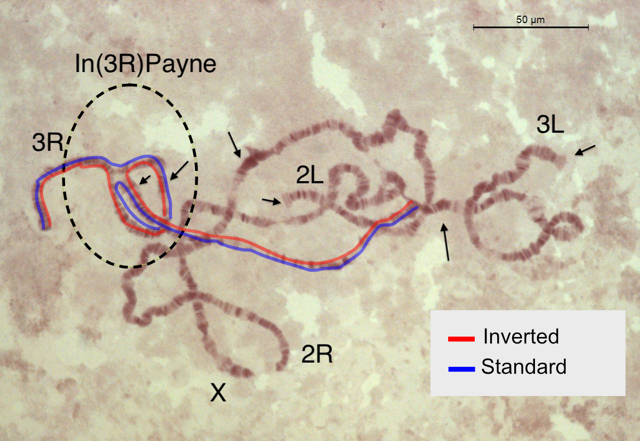
>> **Figure 1**: Cytological preparation of polytene chromosomes from the salivary glands of a third instar Drosophila melanogaster larva which is heterozygote for the In(3R)Payne inversion on the right arm of the third chromosome (3R). The arrows pinpoint banding patterns that are diagnostic for the chromosomal arms, the dashed-lined ellipse indicates the inversion and the red and blue lines indicate the orientation of the two paired sister chromatids (inverted and standard, respectively) with different karyotype that form a characteristic inversion loop. The insert in the bottom right corner shows a schematic representation of the inversion loop, where the letters represents genes along the chromosome which should illustrate that the region spanned by “BCD” is inverted in the red haplotype as highlighted by a grey badly drawn box on top of the linear alignment of the two karyotypes at the bottom of the insert.
 
When a new inversion arises, it captures a single haplotype of the ancestral standard arrangement. The evolutionary fate of the new inversion is initially determined by genetic drift and by the fitness of the captured haplotype relative to the rest of the population (1, 22, 27). Subsequently, divergence among the karyotypes builds up continuously due to the accumulation of novel mutations. However, gene flux in distance to the breakpoints keeps homogenizing the genetic variation (28) and will lead to a pattern of sequence divergence that resembles a “suspension bridge” in inversions that are sufficiently old to harbour many novel mutations (29). Accordingly, inversions may strongly influence the patterns of genetic variation in the corresponding genomic region (22, 27, 30).
Particularly large chromosomal inversions are considered to play an important evolutionary role given their impact on genetic processes. These effects range from (1) positional shifts of genes within a chromosome, which may perturb their expression patterns (e.g., 31, 32), (2) inviable recombination products in heterozygotes, as explained above, to (3) putative pseudogenization in the breakpoint regions (e.g., 33) when the inversion disrupts a previously functional gene. While these effects can be deleterious and lead to a rapid loss of the inversion, they may also provide strong adaptive effects. In support of an adaptive value of inversions, we find overwhelming evidence that many inversions are common and contribute to adaptive phenotypic variation (for comprehensive reviews, see 1–3, 29, 30, 34–37). Given their ability to suppress recombination, inversion can keep co-evolved genes together and protect these against maladaptive recombination and thus act as so-called supergenes (38, 39). Accordingly, inversions commonly form the genetic basis of complex phenotypic variation. Prominent examples of phenotypes influence by inversions include male morphs in the ruff, a beautiful wader bird which is characterized by discrete behavioral and morphological differences in males (40–42), mimicry in wing coloration in Heliconius butterflies (43, 44), ecotypes in monkeyflower of the genus Mimulus adapted to different environmental conditions (45, 46) or shell morphs of Littorina saxatilis, which are snails adapted to different locations and conditions along the marine intertidal shoreline (47).
Different selection mechanisms may directly or indirectly favour inversions and lead to an increase in their frequency (3, 29, 35, 36, 48). Inversions can, for example, accumulate beneficial mutations around their breakpoints and increase in frequency due to strong linkage disequilibrium (LD) with the positively selected alleles (1). Alternatively, inversions may pick up a locally adapted haplotype through gene flux and then become highly beneficial because they protect the local haplotype against maladaptive recombination with deleterious haplotypes that are introduced to the population through migration (37, 49, 50). Inversions may also spread because they keep together epistatic combinations of beneficial alleles inside the inversion even in absence of migration load (51–54). Similar to the former mechanism, inversions, in this case, confer a selective advantage because of suppressed recombination, which prevents that beneficial allelic combinations are broken up. The beneficial effect of the inversion is thus highest when it segregates at intermediate frequencies and the proportion of heterozygotes is thus maximized in a population. Inversions that are favoured, because they lead to suppressed recombination, are thus often assumed to be under balancing selection, which maintains them at intermediate frequencies (reviewed in 1, 30). Consistent with this hypothesis, inversions are commonly found to occur at intermediate frequencies in many populations, such as the common cosmopolitan inversions In(2L)t and In(3R)Payne from D. melanogaster (19, 35). Moreover, clinal patterns along different environmental gradients that are repeated on multiple continents further indicate that inversions play a key evolutionary role and are maintained due to ecological selection (e.g., 55–59).
In this book chapter, I will present a bioinformatics analysis pipeline which allows to assess the influence of inversions on genetic variation in natural populations. We will focus on the vinegar fly D. melanogaster, which is characterized by seven chromosomal inversions that are commonly found world-wide in many populations (19). Using genomic data from different sources and a broad range of bioinformatics analyses tools, we will study the two aforementioned, originally African (31, 60) and now common cosmopolitan inversions, In(2L)t and In(3R)Payne, in a population sample from Zambia, and investigate their effect on genetic variation and differentiation. We will identify single nucleotide polymorphisms (SNPs) in the proximity of the inversion breakpoints which are fixed for different alleles in the inverted and standard chromosomal arrangements (61) using samples with known karyotypes. Using these SNPs as diagnostic markers, we will subsequently estimate inversion frequencies in pooled resequencing (Pool-Seq; 62) data, where individuals with uncertain inversion status are pooled prior to DNA sequencing. In particular, we will utilize the DEST v.2.0 dataset (63, 64), which is a collection of pooled whole-genome sequencing data from more than 700 D. melanogaster population samples, densely collected world-wide through time and space. Using the inversion-specific marker SNPs, we will estimate the inversion frequencies of our two focal inversions in the Pool-Seq data of each population sample and test how inversions influence genome-wide linkage disequilibrium and population structure. Furthermore, we will test for clinal patterns of the inversions in European and North American populations and investigate if these patterns can be explained by demography alone.

### (1) Preparing the bioinformatics analyses pipeline

> The full analysis pipeline of this book chapter can be found at https://github.com/capoony/InvChapter. As a first step, all necessary software needs to be installed. This information can be found in a shell-script called dependencies.sh which is located in the shell/ folder. Here and throughout this chapter, the code blocks, as shown below, are highlighted by boxes with different fonts and colors according to the coding syntax of the BASH shell scripts, which is the main scripting language used in this analysis pipeline (besides specific scripts written in Python and R). It is possible to copy and paste the code snippets directly from this document and then paste and execute them in a terminal window on a workstation computer or computer server with a LINUX operation system. However, I would strongly recommend to open the script main.sh, which is located in the shell/ folder and which contains the whole analysis pipeline shown here, in an integrated development environment (IDE) program such as the VScode (https://code.visualstudio.com/) editor and execute the individual commands from the main.sh script bit by bit.

```bash
### define working directory
WD=</Github/InvChapter> ## replace with path to the downloaded GitHub repo https://github.com/capoony/InvChapter

## install dependencies
sh ${WD}/shell/dependencies
```

> After we make sure that all dependencies are correctly installed, we need to download sequencing data from the Short Read Archive (SRA: https://www.ncbi.nlm.nih.gov/sra) to obtain genomic information of individuals which have previously been characterized for their karyotype. These data will allow us to analyze the influence of inversions on genome-wide patterns of variation and differentiation. We will use the Drosophila Nexus dataset, a collection of more than one thousand whole-genome sequenced D. melanogaster individuals from all over the world (65, 66). We will focus on genomic data of individuals collected in Siavonga/Zambia with known karyotypes, which have been sequenced from haploid embryos (65, 66) by shotgun sequencing from paired-end libraries with Illumina technology. In a first step, we will download and process a metadata-table, which contains the sample names, the corresponding IDs from the SRA database and the inversion status of common inversions. We will use this information to select (up to) 20 individuals from each karyotype (INV and ST) for each of the two common cosmopolitan inversions, In(2L)t and In(3R)Payne. For each of the two inversions we make sure, that INV and ST individuals carry only the focal, but not the other inversion to avoid possible linked effects on genomic variation if both inversions (or only the “wrong” inversion) are present. While such putative linked effects are indeed also interesting, their analysis is beyond the scope of this book chapter. Here, we want to keep the analysis simple and focused on the individual effects of each inversion. After the samples that we will use for our downstream analyses have been selected from the metadata table with a specific R script based on the criteria described above, we will download their raw sequencing data from SRA. As you will see in the code block below, we will focus on the two inversions In(2L)t and In(3R)Payne which we abbreviate with IN2Lt and IN3RP, respectively, for the sake of simplicity. The arrays DATA, Chrom, Start and End contain information of the genomic position for each of the two inversions.

```bash
## Get information of individual sequencing data and isolate samples with known inversion status
mkdir ${WD}/data
cd ${WD}/data

### download metadata Excel table for Drosophila Nexus dataset
wget http://johnpool.net/TableS1_individuals.xls

### process table and generate input files for downstream analyses, i.e., pick the ID's and SRA accession numbers for the first 20 individuals with inverted and standard karyotype, respectively.
Rscript ${WD}/scripts/ReadXLS.r ${WD}

### Define arrays with the inverions names, chromosome, start and end breakpoints; These data will be reused in the whole pipleine for the sequential analysis and visulaization of both focal inversions
DATA=("IN2Lt" "IN3RP")
Chrom=("2L" "3R")
Start=(2225744 16432209)
End=(13154180 24744010)

## Get read data from SRA
mkdir ${WD}/data/reads
mkdir ${WD}/shell/reads
conda activate sra-tools

### loop over both inversions
for index in ${!DATA[@]}; do
    INVERSION=${DATA[index]}

    ## read info from input file {WD}/data/${INVERSION}.txt that was generated above with ReadXLS.r
    while
        IFS=',' read -r ID SRR Inv
    do
        if [[ -f ${WD}/data/reads/${ID}_1.fastq.gz ]]; then
            continue
        fi
        
        echo """
        ## download reads and convert to FASTQ files
        fasterq-dump \
            --split-3 \
            -o ${ID} \
            -O ${WD}/data/reads \
            -e 8 \
            -f \
            -p \
            ${SRR}
        ## compress data
        gzip ${WD}/data/reads/${ID}*
        """ >${WD}/shell/reads/${ID}.sh
        sh ${WD}/shell/reads/${ID}.sh
    done <${WD}/data/${INVERSION}.txt
done
```

> In the next step, we will first trim the raw sequencing data based on base-quality (PHRED score >= 18) and map the trimmed and filtered datasets against the D. melanogaster reference genome (v.6.57; 67), which we will download from FlyBase (https://flybase.org/). We will use a modified mapping pipeline from Kapun et al. (68), which further filters for PCR duplicates and improves the alignment of nucleotides around indels. In brief, this mapping pipeline first uses the program cutadapt to trim away sequencing adapter sequences which are still present in the raw reads and further trims flanking sequences if their base quality encoded as PHRED score is below 18. Since the sequencing data represent paired-end libraries, we will only retain intact read-pairs, where each read has a minimum length of 25 bp for the downstream analyses. We use the program bwa-mem2 for mapping (i.e. aligning) the trimmed read-pairs against the reference genome before sorting the resulting BAM file, which we filter for mapping quality (PHRED >= 20) and correctly oriented read-pairs, by genomic position. Using the program Picard, we then identify and remove PCR duplicates in the dataset, which represents reads with identical mapping position that are particularly problematic in pooled sequencing data as they may bias allele frequency estimates. Finally, we use the program GATK to realign reads around indel positions to avoid false positive SNP variants due to misalignment. To keep the analysis pipeline concise, I collected all commands for the mapping pipeline in a separate shell script mapping.sh, which can be found in the shell/ folder.

```bash

## obtain D. melanogaster reference genome from FlyBase
cd ${WD}/data
wget -O dmel-6.57.fa.gz http://ftp.flybase.net/genomes/Drosophila_melanogaster/current/fasta/dmel-all-chromosome-r6.57.fasta.gz

## index the reference genome for the mapping pipeline
conda activate bwa-mem2
bwa-mem2 index dmel-6.57.fa.gz
gunzip -c dmel-6.57.fa.gz >dmel-6.57.fa
samtools faidx dmel-6.57.fa
samtools dict dmel-6.57.fa >dmel-6.57.dict
conda deactivate

## trim & map & sort & remove duplicates & realign around indels
for index in ${!DATA[@]}; do
    INVERSION=${DATA[index]}
    while
        IFS=',' read -r ID SRR Inv
    do
        ### run the mapping pipeline with 100 threads (modify to adjust to your system ressources). Note that this step may take quite some time
        sh ${WD}/shell/mapping.sh \
            ${WD}/data/reads/${ID}_1.fastq.gz \
            ${WD}/data/reads/${ID}_2.fastq.gz \
            ${ID} \
            ${WD}/mapping \
            ${WD}/data/dmel-6.57 \
            100 \
            ${WD}/scripts/gatk/GenomeAnalysisTK.jar
    done <${WD}/data/${INVERSION}.txt
done
```

> Using the mapping pipeline, we aligned all reads against the D. melanogaster reference genome. Thus, we can now obtain the allelic information for each sample at every position in the reference genome, which is stored in the final BAM files. Since the sequencing data was generated from haploid embryos, we assume that there is only one correct allele present in each sample at a given genomic position. We will now identify polymorphisms using the FreeBayes variant calling software and store the SNP information across all samples in VCF files. To speed these analyses up, I am using GNU parallel (69) with 100 threads, which splits the reference genome in chunks of 100,000 bp and process up to 100 chunks in parallel.

```bash

## SNP calling using freebayes with 100 threads
for index in ${!DATA[@]}; do

    INVERSION=${DATA[index]}
    while
        IFS=',' read -r ID SRR Inv
    do
        mkdir -p ${WD}/results/SNPs_${INVERSION}

        ### store the PATHs to all BAM files in a text, which will be used as the input for FreeBayes
        echo ${WD}/mapping/${ID}_RG.bam >>${WD}/mapping/BAMlist_${INVERSION}.txt

    done <${WD}/data/${INVERSION}.txt

    conda activate freebayes

    ### We assume ploidy = 1 and run FreeBayes in parallel by splitting the reference genome in chuncks of 100,000bps and and use GNU parallel for multithreading. I am using 100 threads. Please adjust to your system. 
    freebayes-parallel \
        <(fasta_generate_regions.py \
            ${WD}/data/dmel-6.57.fa.fai \
            100000) \
        100 \
        -f ${WD}/data/dmel-6.57.fa \
        -L ${WD}/mapping/BAMlist_${INVERSION}.txt \
        --ploidy 1 |
        gzip >${WD}/results/SNPs_${INVERSION}/SNPs_${INVERSION}.vcf.gz
    conda deactivate
done
```

### (2) Patterns of genomic variation and differentiation associated with different karyotpes in an African population from Zambia.
> In the next step, we will use population genetic statistics to compare genetic variation among Zambian INV and ST individuals with inverted and standard arrangement for the two inversions In(2L)t and In(3R)Payne, respectively. We will calculate Nei’s π (nucleotide diversity; , 70) as an estimator of genetic variation in a population. Since VCFtools (71), the program which we use to calculate the population genetic statistics, does not allow calculating these statistics from haploid VCF files, we will first convert the haploid VCF to a diploid version by duplicating the haploid haplotype for each individual. Then, we will calculate π in 200,000 bp windows along the whole genome for the standard and the inverted individuals.


#### (2.1) The influence of inversions on genetic variation
```bash
## calculate pi per karyotype
for index in ${!DATA[@]}; do
    INVERSION=${DATA[index]}

    mkdir ${WD}/data/${INVERSION}
    output_dir=${WD}/data/${INVERSION}

    ### split input file with sample IDs based on Inversions status
    awk -F',' '
    {
        filename = $3 ".csv"
        filepath = "'$output_dir'/" filename
        if (filename == ".csv") next
        print $1 >> filepath
    }
    ' ${WD}/data/${INVERSION}.txt

    ### filter VCF for biallelic SNPs
    conda activate vcftools

    vcftools --gzvcf ${WD}/results/SNPs_${INVERSION}/SNPs_${INVERSION}.vcf.gz \
        --min-alleles 2 \
        --max-alleles 2 \
        --remove-indels \
        --recode \
        --out ${WD}/results/SNPs_${INVERSION}/SNPs_${INVERSION}

    gzip ${WD}/results/SNPs_${INVERSION}/SNPs_${INVERSION}.recode.vcf

    ### convert haploid VCF to diploid
    <ins>Python</ins> ${WD}/scripts/hap2dip.py \
        --input ${WD}/results/SNPs_${INVERSION}/SNPs_${INVERSION}.recode.vcf.gz \
        --output ${WD}/results/SNPs_${INVERSION}/SNPs_${INVERSION}.recode_dip.vcf.gz

    for karyo in INV ST; do

        ### calculate pi in 200kbp windows
        vcftools --gzvcf ${WD}/results/SNPs_${INVERSION}/SNPs_${INVERSION}.recode_dip.vcf.gz \
            --keep ${WD}/data/${INVERSION}/${karyo}.csv \
            --window-pi 200000 \
            --out ${WD}/results/SNPs_${INVERSION}/${INVERSION}_${karyo}_pi
    done

    ## combine pi of INV and ST chromosomes
    awk 'NR ==1 {print $0"\tType"}' ${WD}/results/SNPs_${INVERSION}/${INVERSION}_INV_pi.windowed.pi >${WD}/results/SNPs_${INVERSION}/${INVERSION}_pi.tsv
    awk 'NR>1  {print $0"\tINV"}' ${WD}/results/SNPs_${INVERSION}/${INVERSION}_INV_pi.windowed.pi >>${WD}/results/SNPs_${INVERSION}/${INVERSION}_pi.tsv
    awk 'NR>1  {print $0"\tST"}' ${WD}/results/SNPs_${INVERSION}/${INVERSION}_ST_pi.windowed.pi >>${WD}/results/SNPs_${INVERSION}/${INVERSION}_pi.tsv

done
```

> After we merged all π estimates for both karyotypes in a single file for each inversion, we plot the genome-wide patterns in line-plots for each chromosome and each karyotype. Here and in the rest of this pipeline, we will use ggplot from the tidyverse package (72) in R (73) for creating graphics. For the sake of brevity, I collected all R code in separate R-scripts, which can all be found in the scripts/folder.

```bash
### plot PI as line plot
for index in ${!DATA[@]}; do

    INVERSION=${DATA[index]}
    St=${Start[index]}
    En=${End[index]}
    Ch=${Chrom[index]}

    Rscript ${WD}/scripts/Plot_pi.r \
        ${INVERSION} \
        ${Ch} \
        ${St} \
        ${En} \
        ${WD}

done
```

With the exception of the genomic regions of the two inversions (In(2L)t: Figure 2, top; and In(3R)Payne: Fig. 2, bottom), we find that π-values are very similar, irrespective of the karyotype (INV: red and ST: blue), across the whole genome. In contrast, we see that genetic variation within the inverted regions is markedly reduced in INV individuals, which suggests that the population sizes of both inversions are smaller than the standard arrangement. These patterns may, moreover, also indicate that gene flux and novel mutations did not have enough time yet to reconstitute genetic variation similar to the ancestral arrangement (22). In addition, we see that the reduction of genetic variation is not equal across the whole inverted region. Rather, the reduction is strongest close to the breakpoints. This indicates that gene flux in the center of the inversion has, at least partially, shifted genetic variation from the standard arrangement into the inverted chromosomes. In the case of In(2L)t, we further find that the effect of the inversion on genetic variation is not confined to the region spanned by the inversion but rather spreads millions of base pairs beyond the breakpoints (Figure 2; top). Finally, we also observe that the distribution of nucleotide diversity varies along each chromosome and is strongly reduced close to the centro- and telomers (Figure 2). These particular regions are characterized by reduced recombination rates, which influences the extend of background selection leading to reduced variation in these chromosomal regions (74).

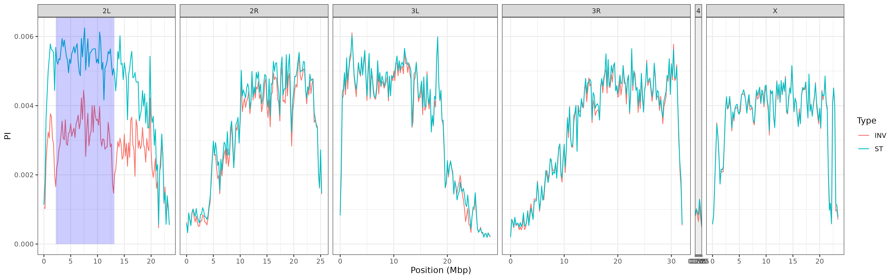
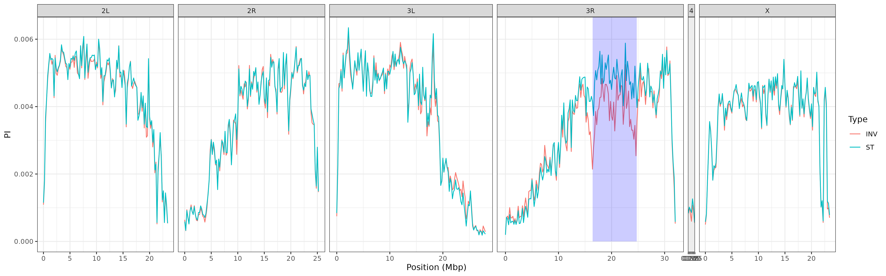
>> **Figure 2**: Line plots showing the distribution of nucleotide diversity π along the genome averaged in 200kbp non-overlapping windows for inverted (red) and non-inverted (blue individuals). The genomic regions spanned by the inversions by In(2L)t (top) and In(3R)Payne (bottom) are highlighted by transparent blue boxes.


#### (2.2) The influence of inversions on genetic differentiation
>In the next part, we will use the diploid SNP dataset generated above to calculate FST estimates among the INV and ST individuals for each inversion using the method of Weir & Cockerham (75) as implemented in VCFtools. The fixation index FST summarizes genetic structure and is scaled between zero (no differentiation) and one (complete differentiation). We will use this metric to identify single SNPs, which are strongly differentiated between the karyotypes. In addition, we will calculate FST averaged in 200,000 bp windows to find genomic regions, where many neighbouring SNPs show similar differentiation patterns.

```bash
## calculate FST between karyotypes
for index in ${!DATA[@]}; do
    INVERSION=${DATA[index]}

    conda activate vcftools

    ## calculate FST per SNP
    vcftools --gzvcf ${WD}/results/SNPs_${INVERSION}/SNPs_${INVERSION}.recode_dip.vcf.gz \
        --weir-fst-pop ${WD}/data/${INVERSION}/INV.csv \
        --weir-fst-pop ${WD}/data/${INVERSION}/ST.csv \
        --out ${WD}/results/SNPs_${INVERSION}/${INVERSION}.fst

    ## calculate FST in 200kbp windows
    vcftools --gzvcf ${WD}/results/SNPs_${INVERSION}/SNPs_${INVERSION}.recode_dip.vcf.gz \
        --weir-fst-pop ${WD}/data/${INVERSION}/INV.csv \
        --weir-fst-pop ${WD}/data/${INVERSION}/ST.csv \
        --fst-window-size 200000 \
        --out ${WD}/results/SNPs_${INVERSION}/${INVERSION}_window.fst

    conda deactivate
done
```

>Now, we plot both SNP-wise FST as well as FST values averaged in 200kbp windows. These types of plots are so-called Manhattan plots, where each dot represents a polymorphic genomic position along the x-axis and the corresponding FST value are shown on the y-axis. On top, we are plotting the window-wise FST as a line and highlight the region of the corresponding inversion by a transparent blue box.

```bash
for index in ${!DATA[@]}; do

    INVERSION=${DATA[index]}
    St=${Start[index]}
    En=${End[index]}
    Ch=${Chrom[index]}

    ### plot FST as Manhattan Plots
    Rscript ${WD}/scripts/Plot_fst.r \
        ${INVERSION} \
        ${Ch} \
        ${St} \
        ${En} \
        ${WD}
done
```

As you can see in Figure 3 for In(2l)t (top) and In(3R)Payne (bottom), genetic differentiation is elevated among the karyotypes within the inversion and particularly at and around the inversion breakpoints. These patterns suggest that novel mutations building up over time in the proximity of the inversion breakpoints result in strong differentiation. Consistent with theory, the suppression of recombination prevents genetic homogenization among the karyotypes across the whole inverted region, but specifically at the breakpoints (22). Particularly for In(3R)Payne, we observe a typical “suspension bridge” pattern of genetic differentiation within the inversion (29), which suggests that gene flux in distance to the breakpoints and towards the center of the inversion has led to a homogenization of genetic variation across the two karyotypes (27). Similar to Figure 2, we also observe that patterns of differentiation spread way beyond the inversion breakpoints, as shown for In(2L)t, which further emphasizes the genome-wide impact of inversions on genetic variation. 

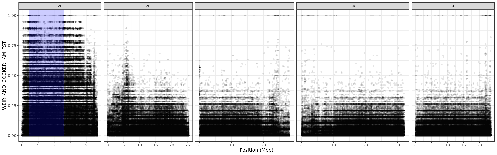
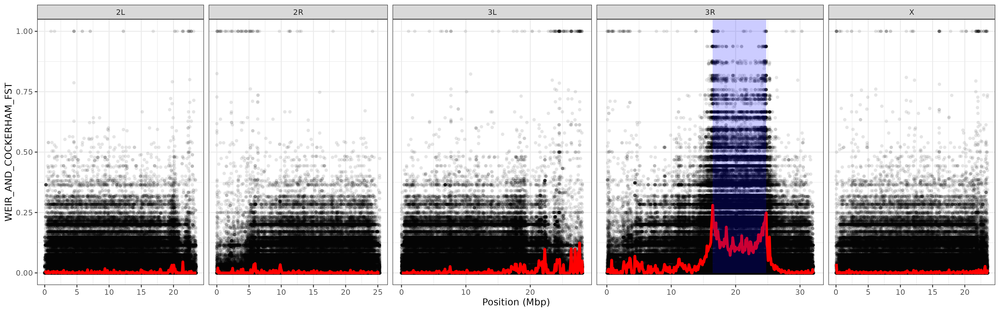
>> **Figure 3**: Manhattan plots showing the distribution of SNP-wise FST between INV and ST individuals along the genome. In addition, averaged FST values in 200kbp windows are overlaid as line plots in red and the genomic regions spanned by the inversions In(2L)t (top) and In(3R)Payne (bottom) are highlighted by transparent blue boxes.

### (3) SNPs in strong linkage disequilibrium with different karyotypes
Several SNPs that are clustered at the inversion breakpoints in the Manhattan plots of Figure 3 show very high FST values, which indicates complete or near complete fixation for different alleles between the two karyotypes. We therefore assume that many SNPs are in complete linkage disequilibrium (LD) with the inversion - at least in the particular Zambian population sample that we investigate here. In those SNPs, one allele is associated with the inverted karyotype (INV) and the other with the standard arrangement (ST). This makes it possible to use these SNPs as diagnostic markers that allow to (1) test if the sequencing data of given individual with unknown karyotype is carrying the inversion simply by tracing for the inversion-specific allele at the corresponding diagnostic markers. Furthermore, (2) it is possible to estimate the frequency of inverted chromosomes in pooled sequencing (Pool-Seq) data, where multiple individuals are pooled prior to DNA extraction and the pool of DNA is then sequenced jointly (61). In the latter type of datasets, it is assumed that the allele frequency in the pooled sequencing reliably estimates the actual frequency of the allele in the population from which the pooled individuals were randomly sampled (76). Thus, the median frequency of the inversion-specific alleles in the pooled dataset should roughly correspond to the inversion frequency given that these SNPs are in tight LD with the inversion. However, I need to caution here, that these markers should - at best - be applied only to sequencing data from samples collected in the same broader geographic region, or that diagnostic maker SNPs are defined using a mixed sample of individuals with known karyotype from all areas where the corresponding inversion occurs. The evolutionary history of inversions with a broad geographic distribution may be very complex and characterized by the emergence and fixation of different SNPs within the inversion in different geographic regions (31).

#### (3.1) Inversion-specific diagnostic marker SNPs
> In the following, we will use a custom script that searches the VCF files with samples specific to the In(2L)t and In(3R)Payne analyses for potential candidate SNPs. Specifically, we will focus on SNPs that are in full LD with either of the two focal inversions and which are located within 200kbp distance to an inversion breakpoint. For these SNPs, we will then isolate the alleles that are fixed within the inverted chromosomes.

```bash
## obtain diagnostic SNPs for each inversion
for index in ${!DATA[@]}; do

    INVERSION=${DATA[index]}
    St=${Start[index]}
    En=${End[index]}
    Ch=${Chrom[index]}
    
    ### store the chormosome, start and endpoints of each inversion as a comma-separated string
    BP="${Ch},${St},${En}"

    ### only retain the header and the rows on the "correct" chromosome and focus on the focal individuals that are either INV or ST
    gunzip -c ${WD}/results/SNPs_${INVERSION}/SNPs_${INVERSION}.recode.vcf.gz |
        awk -v Ch=${Ch} '$1~/^#/|| $1 == Ch' |
        <ins>Python</ins> ${WD}/scripts/DiagnosticSNPs.py \
            --range 200000 \
            --breakpoints ${BP} \
            --input - \
            --output ${WD}/results/SNPs_${INVERSION}/${INVERSION} \
            --MinCov 10 \
            --Variant ${WD}/data/${INVERSION}.txt
done
```

Our analysis results in 62 and 26 diagnostic SNPs for In(2L)t and In(3R)Payne, respectively. In the following paragraphs, we will use these marker SNPs to indirectly infer inversion frequencies in other genomic datasets, but before that, we will test if inversions influence population structure in D. melanogaster population samples from North America and Europe without prior information on inversion frequencies in the corresponding samples.    

#### (3.2) The influence of inversions on population structure
To this end, we will use the largest Pool-Seq dataset of natural D. melanogaster populations available to date. The DEST v.2.0 dataset combines more than 700 world-wide population samples of vinegar flies from different sources that were densely collected through space and time, yet mostly from North American and from European populations (63, 64, 68). All shotgun sequence data were processed with a standardized trimming and mapping pipeline (as described above) prior to joint SNP calling with the heuristic variant caller PoolSNP (68). Moreover, DEST v.2.0. also provides rich metadata, including detailed information on the sampling date and location, basic sequencing statistics (such as read depths, SNP counts, etc.) and recommendations based on data quality assessments (64). With the help of these metadata, we will subset the full data and only consider population samples of high quality and focus on samples collected from North America and Europe, respectively. Then, we will apply principal component analyses (PCA) to the allele frequency data in order to identify genome-wide differences among the samples in our datasets. In essence, the first few orthogonal PC-axes capture most of the genetic variation shared across genome-wide SNPs and reflect the shared evolutionary history of the populations in the dataset (77). For these reasons, PCA is a very popular model-free method to quantify population structure. In our example, we will compare the results of PCA applied to SNPs either located within the genomic region spanned by each of the inversions or in distance to these inversion-specific genomic regions. These analyses will reveal if the inversions have an influence on population structure in their genomic region and how these patterns differ from genome-wide estimates.

> As a first step, we will download both the DEST v.2.0 SNP data in VCF file-format and the corresponding metadata as a comma-separated (CSV) table from the DEST website. In addition, we will download two scripts from the DEST pipeline that are needed for the downstream analyses.


```bash 
### download VCF file and metadata for DEST dataset
cd ${WD}/data
wget -O DEST.vcf.gz http://berglandlab.uvadcos.io/vcf/dest.all.PoolSNP.001.50.3May2024.ann.vcf.gz
wget -O meta.csv https://raw.githubusercontent.com/DEST-bio/DESTv2/main/populationInfo/dest_v2.samps_3May2024.csv

###  download sripts
cd ${WD}/scripts
wget https://raw.githubusercontent.com/DEST-bio/DESTv2_data_paper/main/16.Inversions/scripts/VCF2sync.py
wget https://raw.githubusercontent.com/DEST-bio/DESTv2_data_paper/main/16.Inversions/scripts/overlap_in_SNPs.py
```

> Using the metadata table, we will identify all samples that we are going to include in our continent-wide analyses of populations from North America and Europe. Furthermore, we will apply several filtering steps to the VCF file and, based on metadata information, we will construct two continent-specific datasets consisting of allele frequency data that we will use for all downstream analyses. Specifically, we will (1) isolate continent-specific populations, (2) remove problematic samples (based on DEST recommendations), remove (3) populations with < 15-fold average read depth, (4) only retain biallelic SNPs, (5) convert the allele counts to frequencies of the reference allele and obtain (6) read-depths for each position and population sample. Finally, (7) we will restrict our analyses to 50,000 randomly drawn genome-wide SNPs. The final files will represent a two-dimensional matrix of reference allele frequencies (based on the reference genome), where rows represent polymorphic genomic positions and columns represent population samples.

```bash
### Split metadata by continent

## remove single quotes from metadata table
sed -i "s/'//g" ${WD}/data/meta.csv

## split by continent
awk -F "," '$6 =="Europe" {print $1}' ${WD}/data/meta.csv >${WD}/data/Europe.ids
awk -F "," '$6 =="North_America" {print $1}' ${WD}/data/meta.csv >${WD}/data/NorthAmerica.ids

## get data for populationes that did not pass the quality criteria (no PASS and average read depths < 15)
awk -F "," '$(NF-7) !="Pass" || $(NF-9)<15 {print $1"\t"$(NF-7)"\t"$(NF-9)}' ${WD}/data/meta.csv >${WD}/data/REMOVE.ids

### subset the VCF file 

mkdir ${WD}/results/SNPs

for continent in NorthAmerica Europe; do

    conda activate vcftools

    ## decompress VCF file
    pigz -dc ${WD}/data/DEST.vcf.gz |

        ## keep header and position with only one alternative allele
        awk '$0~/^\#/ || length($5)==1' |

        ## keep continental data and remove bad quality samples
        vcftools --vcf - \
            --keep ${WD}/data/${continent}.ids \
            --remove ${WD}/data/REMOVE.ids \
            --recode \
            --stdout |

        ## remove rows with missing data
        grep -v "\./\." |

        ## randomly samples 50,000 SNPs
        <ins>Python</ins> ${WD}/scripts/SubsampleVCF.py \
            --input - \
            --snps 50000 |

        ## convert VCF to allele frequencies and weigths (of the reference allele)
        <ins>Python</ins> ${WD}/scripts/vcf2af.py \
            --input - \
            --output ${WD}/results/SNPs/${continent}

done
```

> Now, we will employ separate principal component analyses (PCA) for European and North American samples to test if the genetic variation in the genomic region spanned by an inversion influences signals of population structure. To this end, we will execute the R script PCA_inv.r in the scripts/ folder to carry out the following analysis steps: At first, we will load the allele frequency datasets generated above and split the data in two subsets, where one subset contains SNPs located within the genomic region of a given inversion and the other contains SNPs from the remaining (inversion-free) part of the genome. Then, we will perform PCA on the transposed allele frequency matrices, where columns represent chromosomal positions and rows represent population samples. Finally, we will use metadata information to highlight the country/county of origin in scatterplots that show the first two PC-axes for each subset per continent and inversion.

```bash
### use PCA to test for patterns inside and outside the genomic region spanned by an inversion
Rscript ${WD}/scripts/PCA_Inv.r \
    ${WD}
```

The scatterplots in Figure 4 show the first two PC-axes, which together explain between 8%-12% of the total genetic variation of all SNPs included in the analysis. Notably, the PC-scores of genome-wide SNPs in Europe (top) and North America (bottom) cluster populations mostly according to expectations based on geography. Conversely, PC-scores calculated from SNPs inside the breakpoints of In(2L)t and In(3R)Payne are much more compressed and appear to mostly follow some diagonals rather than clustering according to geography - particularly for PC1 (see also 78). We may thus speculate that genetic variation associated with inversion, and thus inversion frequencies, strongly contribute to the observed patterns in the investigated populations.

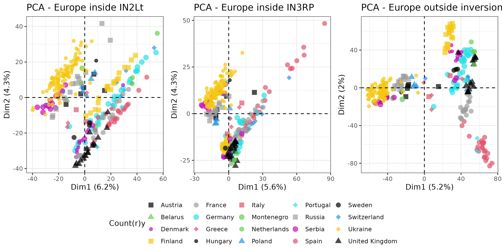
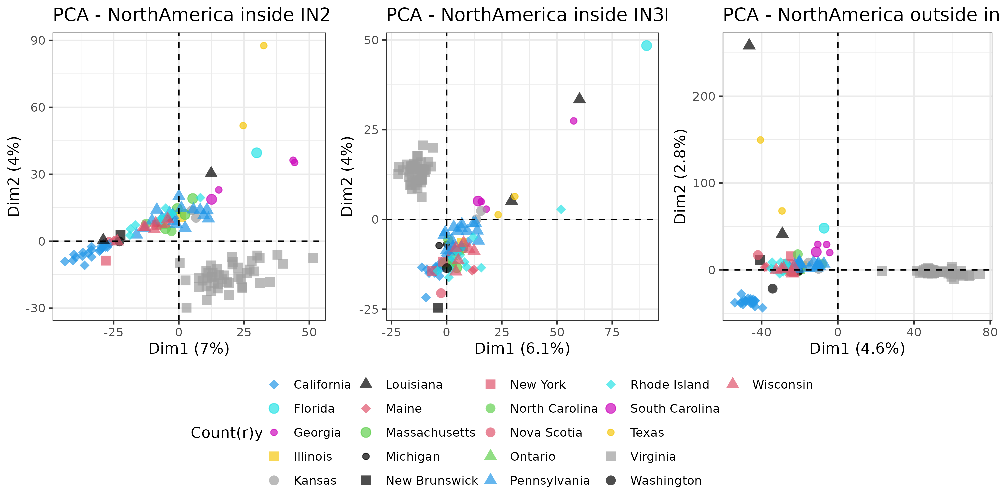
>> **Figure 4**: Scatter plots showing the first two PC axes (Dim 1 and Dim 2) of PCAs based on SNPs in European (top panels) or North American (bottom panels) populations located either inside the genomic region spanned by an inversion (left two panels for In(2L)t and In(3R)Payne, respectively) or in the remaining genome (right-most panels). We highlight the country of origin using a combination of different colors and shapes. The numbers in parentheses next to the axis labels indicate the total variance explained by the corresponding PC-axis.

### (4) Inversion frequencies in Pool-Seq data
We will now take advantage of the diagnostic marker SNPs that we isolated above and will estimate inversion frequencies in each of the pooled population samples in Europe and North America, respectively. This will allow us to test more directly how inversions influence genetic variation and population structure and if the two inversions exhibit clinal variation.

#### (4.1) Estimating inversion frequencies in Pool-Seq data with diagnostic markers
> We will now convert the VCF file to the SYNC file format using the Python script VCF2sync.py from the DEST pipeline. SYNC files are commonly used to store allele counts in pooled sequencing data as colon-separated lists in the form “A:T:C:G:N:Del” for each population sample and position. We will then obtain allele counts from the SYNC file at the positions of inversion-specific marker SNPs that are present in the DEST dataset using the Python script overlap_in_SNPs.py. To speed these calculations up, I am using GNU parallel with 100 threads.

```bash
### convert VCF to SYNC file format
conda activate parallel
gunzip -c ${WD}/data/DEST.vcf.gz |
    parallel \
        --jobs 100 \
        --pipe \
        -k \
        --cat python3 ${WD}/scripts/VCF2sync.py \
        --input {} |
    gzip >${WD}/data/DEST.sync.gz

### Get positions at inversion specific marker SNPs
for index in ${!DATA[@]}; do

    INVERSION=${DATA[index]}
    gunzip -c ${WD}/data/DEST.sync.gz |
        parallel \
            --pipe \
            --jobs 100 \
            -k \
            --cat python3 ${WD}/scripts/overlap_in_SNPs.py \
            --source ${WD}/results/SNPs_${INVERSION}/${INVERSION}_diag.txt \
            --target {} \
            >${WD}/data/DEST_${INVERSION}.sync
done
```
> For each population and for each of the two inversions, we now calculate the median frequency of the inversion-specific alleles across all diagnostic markers to obtain an estimate of the corresponding inversion frequency with a custom Python script. Before that, we need to obtain the names of all samples in the VCF file in the correct order and then output the estimated inversion frequencies as a tab-delimited file.
```bash
### get the names of all samples in the VCF file and store as an array
NAMES=$(gunzip -c ${WD}/data/DEST.vcf.gz | head -150 | awk '/^#C/' | cut -f10- | tr '\t' ',')

# Calculate median frequencies for marker SNPs
for index in ${!DATA[@]}; do

    INVERSION=${DATA[index]}

    python3 ${WD}/scripts/inversion_freqs.py \
        --marker ${WD}/results/SNPs_${INVERSION}/${INVERSION}_diag.txt \
        --input ${WD}/data/DEST_${INVERSION}.sync \
        --names $NAMES \
        --inv ${INVERSION} \
        >${WD}/results/SNPs_${INVERSION}/${INVERSION}.af

done
```
> To visually inspect the distribution of inversion-specific alleles across all diagnostic markers for each inversion and population sample, we plot histograms of all inversion-specific allele frequencies and the actual allele frequencies of all diagnostic SNPs against their genomic position. In addition, we plot the median frequency, which we consider the estimated inversion frequency, as a dashed line atop the frequency histogram. We therefore need to first generate a table with the inversion-specific allele frequencies of the diagnostic SNPs for all population samples in the DEST v.2.0 VCF file. Then, we generate the above-mentioned plots of allele frequencies in R using the script Plot_InvMarker.r in the scripts/ folder.

```bash
### generate plots for each population
for index in ${!DATA[@]}; do

    INVERSION=${DATA[index]}
    Ch=${Chrom[index]}

    ### convert VCF to allele frequency table for each SNP and population sample
    gunzip -c ${WD}/data/DEST.vcf.gz |
        awk -v Ch=${Ch} '$1~/^#/|| $1 == Ch' |
        python3 ${WD}/scripts/AFbyAllele.py \
            --input - \
            --diag ${WD}/results/SNPs_${INVERSION}/${INVERSION}_diag.txt \
            >${WD}/results/SNPs_${INVERSION}/${INVERSION}_pos.af

    ### make plots in R
    Rscript ${WD}/scripts/Plot_InvMarker.r \
        ${INVERSION} \
        ${WD}
done
```
The example in Figure 5 shows the distribution of inversion-specific alleles for In(2L)t in a population sample collected in 2015 close to Mautern in the beautiful Wachau area along the Danube river in Austria. As you can see in the scatterplot, two sets of SNPs are located around the breakpoints of In(2L)t and the frequencies of the inversion-specific alleles span from 0% to more than 60%, which is quite a broad range and presumably the result of sampling error in the Pool-Seq data. Assume that even if a diagnostic SNP is in full linkage disequilibrium with the inversion, it will not necessarily depict the “true” frequency of the inversion in the population due to binomial sampling. When sequencing the pooled DNA from multiple samples with NGS methods such as Illumina, we are usually sampling (i.e., sequencing) 50 to 100 DNA fragments at every genomic position, which corresponds to a 50 to 100-fold sequencing depth. This is, of course, only a very small fraction of the millions of copies of genomic DNA in the extracted DNA. The resulting sampling error leads to deviations from the expected frequency (i.e., the true allele frequency in all the DNA copies) and these deviations become even larger the lower the sequencing depths are. However, if we further assume that each SNP is a reliable estimator of the “true” inversion frequency due to perfect linkage disequilibrium, we expect that the inferred frequencies across all marker SNPs roughly follow a binomial distribution, where the sequencing depth corresponds to the number of trials n and the expected inversion frequency corresponds to the number of successes p. However, other factors, such as sequencing and mapping errors or imperfect LD of some diagnostic SNPs in certain geographic regions (see also above in the introduction to paragraph 3) may also influence the distribution of frequencies. Rather than calculating the mean frequencies across all markers, we use the median to estimate the population inversion frequency and compare inversion patterns in all population samples, since this statistic is more robust to asymmetric distributions. In our example in Figure 5, the median is shown as a dashed red line at app. 25%.

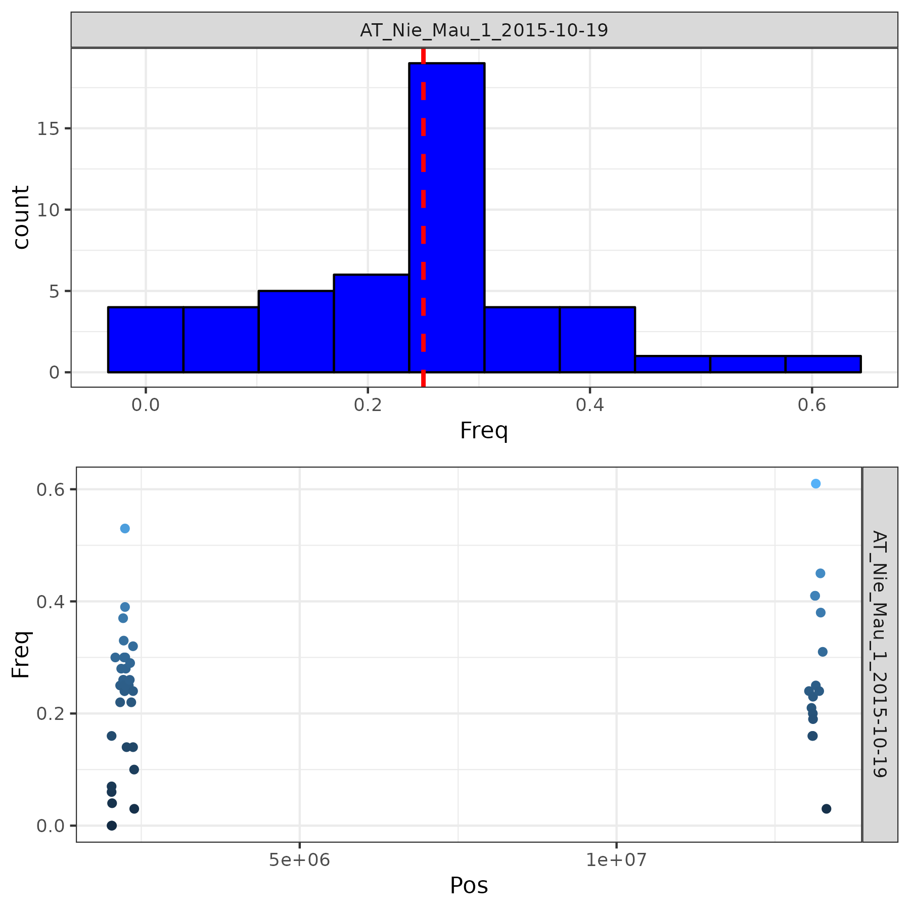
>> **Figure 5**: Frequencies of alleles from the diagnostic marker SNPs for In(2Lt) that are in strong LD plotted against their genomic position on chromosome 2L for one population sample from Mautern in Lower Austria collected in 2015. A histogram of allele frequencies plotted on the right along the y-axis shows the range of frequencies across all marker SNPs. In addition, we plot the median allele frequency across all markers as a horizontal dashed line in red, which we consider the estimated inversion frequency in the population sample.

#### (4.2) The influence of inversions on population structure revisited
In paragraph 3.2 we found that the genomic regions spanned by inversions differ in patterns of population structure from the remaining genome. We speculated that inversion frequencies may play an important role. Now, that we have estimated inversion frequencies in all populations based on the diagnostic marker SNPs, we can if this hypothesis is true. We will test for correlations between the scores of PC1 based on SNPs located either inside and outside the genomic region spanned by each inversion and inversion frequencies.

> We will execute the R-script Plot_PCAInvFreq.r, which will create scatterplots based on the PC-scores of the first PC-axis (Dim.1) and the inversion frequency for In(2L)t and In(3R)Payne, fit a linear regression line to each of the plots and add the adjusted R2 value (the determinant of correlation) in the top-right corner of each plot, which describes the proportion of the variance explained by the correlation.

```bash
## does the Inv Frequency influence the PCA results?
for index in ${!DATA[@]}; do

    INVERSION=${DATA[index]}
    Rscript ${WD}/scripts/Plot_PCAInvFreq.r \
        ${INVERSION} \
        ${WD}
done
```
Consistent with our hypothesis, we can see in Figure 6 that all plots on the left side, which show scatterplots of inversion frequencies and PC1 are characterized by very strong and highly significant correlations, which explain 54% to 81% of the total variance. Conversely, we see that the inversion frequency barely explains any variance in the population structure inferred from genome-wide SNPs outside the inversions. We therefore conclude that our initial hypothesis was correct and that the two inversions indeed have a major impact on the distribution of genetic variation and signals of population structure. Thus, not accounting for chromosomal inversions when testing for population structure can lead to wrong conclusions.

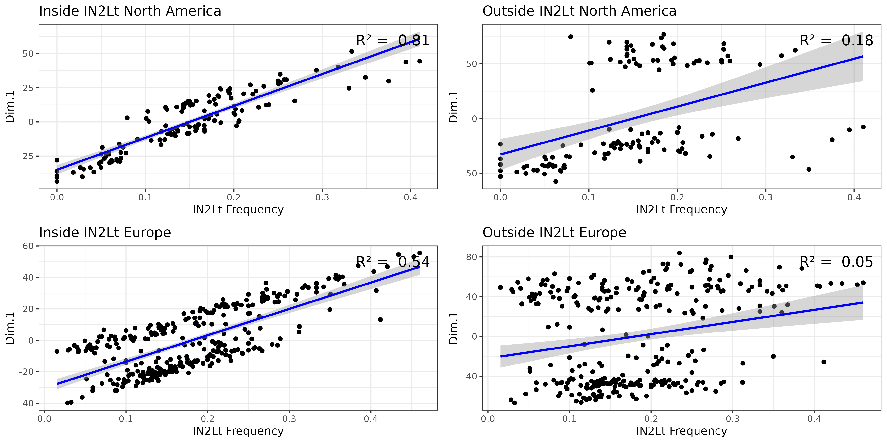
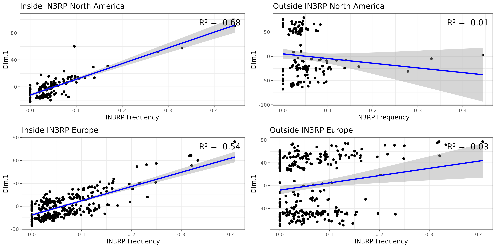
>> **Figure 6**: Scatterplots showing the association between inversion frequencies and the first PC-axis based on SNPs either located inside (left panels) our outside (right panels) the genomic region spanned by In(2L)t (top) or In(3R)Payne (bottom) for Europe (rows 2 and 4) and North America (rows 1 and 3). Regression lines based on linear regression are shown in blue and the determinants of correlation (adjusted R2 value) are printed in the top-right corner of each plot.

#### (4.3) The influence of inversions on genetic differentiation revisited
In the next analysis step, we will extend our previous analysis from paragraph 2.2 where we investigated the influence of inversions on genome-wide differentiation. While these analyses were restricted to a single population in Zambia, we will now investigate hundreds of populations in Europe and North America. Previously, we used FST to quantify (linked) differences between the two karyotypes, but now, we will use logistic regression to test for each SNP in the genome, whether it is significantly correlated with the inversion frequency for either In(2L)t or In(3R)Payne across all populations of the data sets of the two continents. We assume that SNPs that are in strong LD, either due to physical proximity to the inversion or due to co-evolution, (i.e., statistical linkage) will be characterized by a statistically significant regression model.

> Again, the actual analysis steps are stored in the R-script PlotInvLD.r, where the allele frequency matrices and the corresponding read depths are loaded for each continent. Then, logistic regressions will be calculated for each SNP, where the allele frequencies of a given SNP is the dependent variable, the inversion frequency is the independent variable and the read depth is the weight. For each inversion and continent, we then generate Manhattan plots, where the x-axis shows the genomic position of a given SNP and the y-axis shows the negative log10-transformed p-value of a likelihood ratio test of the logistic regression.


```bash
## calculate SNP-wise logistic regressions testing for associations between SNP allele frequencies and inversion frequencies to test for linkage between SNPs and inversions for Europe and North America

for index in ${!DATA[@]}; do

    INVERSION=${DATA[index]}
    St=${Start[index]}
    En=${End[index]}
    Ch=${Chrom[index]}

    Rscript ${WD}/scripts/PlotInvLD.r \
        ${INVERSION} \
        ${Ch} \
        ${St} \
        ${En} \
        ${WD}

done
```

All four Manhattan plots shown in Figure 7 depict that SNPs, whose allele frequencies are influenced by the inversion frequencies in hundreds of natural populations both in Europe and in North America, as indicated by elevated -log10-p-values, are strongly enriched within the genomic regions covered by the corresponding inversions. Similar to the results from paragraph 2.2 we also find that the LD is not only restricted to the genomic regions within the inversion breakpoints. Particularly for In(2L)t, we again find that many SNPs downstream of the distal breakpoint also show highly significant correlations with the inversion, which indicates a suppression of recombination across large parts of this chromosomal arm (56). Since this analysis only includes 50,000 genome-wide polymorphisms, we do not see a strong enrichment of SNPs in high LD at the breakpoints.

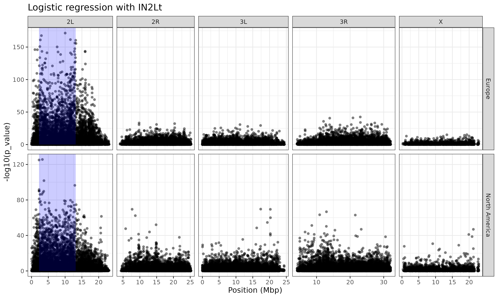
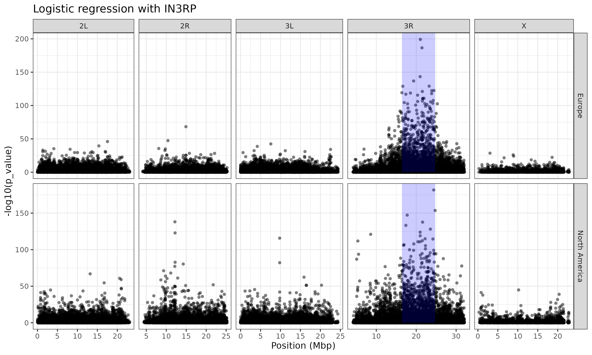
>> **Figure 7**: Manhattan plots showing the results of SNP-wise logistic regressions that test for associations between inversion frequencies and allele frequencies at a given SNP. The p-values are -log10 - transformed and plotted along the y-axis. In addition, we highlight the genomic position of In(2L)t (top) and In(3R)Payne by blue transparent boxes in Europe (rows 1 and 3) and North America (rows 2 and 4).

#### (4.4) Clinal patterns of chromosomal inversions
A large body of literature has documented clinal distributions, i.e., gradual frequency changes of several inversions along environmental gradients. One particularly prominent example is the latitudinal cline of In(3R)Payne along the North American East Coast (35, 56) and in Australia (79). Here, we will similarly test, if the inversion frequencies estimated by our diagnostic marker SNPs show these expected patterns along latitudinal and longitudinal gradients in Europe and North America. Moreover, we will test, if these patterns can be explained by neutral evolution (for example, by mechanisms such as isolation by distance, secondary contact, admixture (80, 81), etc.) alone. In contrast, if the inversion has evolved a clinal distribution due to spatially varying selection, we would assume that the clinal patterns strongly deviate from the genomic background. However, sometimes it is difficult to distinguish neutral and adaptive genomic signals. If, for example, population samples show very strong population structure along an environmental gradient, it may be misleading to only investigate allele frequency differences at a single gene (or inversion) that is considered a candidate for selection. A signal for strong association of allele frequencies at the gene (or inversion) with the environmental gradient may be strongly confounded by (unknown) population structure, which would lead to similar patterns of genetic differentiation between the populations across the whole genome (81, 82). Thus, a signal of differentiation at a single locus may be misinterpreted as the result of selection, while it is in reality the result of the unknown genome-wide evolutionary history. To account for this, we will employ a statistical approach from landscape genomics (83). Latent factor mixed models (LFMM; 84, 85) first identify genome-wide patterns of genetic variation by PCA (very similar to our approach in 3.2) assuming that the first few PC axes capture genome-wide differences which are predominantly the result of the demographic history of the sampled populations. These PC axes are then used as latent (hidden) factors in regression models, which test for associations between allele frequencies and the focal environmental variables - in our case latitude and longitude.

> As a first step, we will test for clinality of the inversions along latitude and longitude in Europe and North America. We will fit general linear models including arcsine square-root transformed inversion frequencies as our dependent variables, which accounts for the skewed variance distribution in binomial data when normality is assumed. Then, we will overlay scatter-plots based on environmental variables and inversion frequencies with a logistic regression curve and print the p-value of the linear models in the top-right corner of each plot using the R-script Plot_Clinality.r.

```bash
## test for clinality of inversion frequency
for index in ${!DATA[@]}; do

    INVERSION=${DATA[index]}
    Rscript ${WD}/scripts/Plot_Clinality.r \
        ${INVERSION} \
        ${WD}
done
```
The plots in Figure 8 are consistent with our a-priori expectations. We do find highly significant inversion clines for both inversions along latitude in North America and for In(3R)Payne also in Europe. In all cases the inversions appear to be frequent in the South and rapidly decline in frequency with increasing latitude. Conversely, very weak clines along longitude are only found for In(3R)Payne in Europe and for In(2L)t in North America. We notice that even the highest inversion frequencies never exceed 50%, which is consistent with previous observations (19, 35) and provides further support that both inversions are shaped by some form of balancing selection. While these clines may be the result of spatially varying selection, we cannot rule out based on this simple analysis that the observed clinal patterns are alternatively the result of the demographic history that shaped the investigated populations.

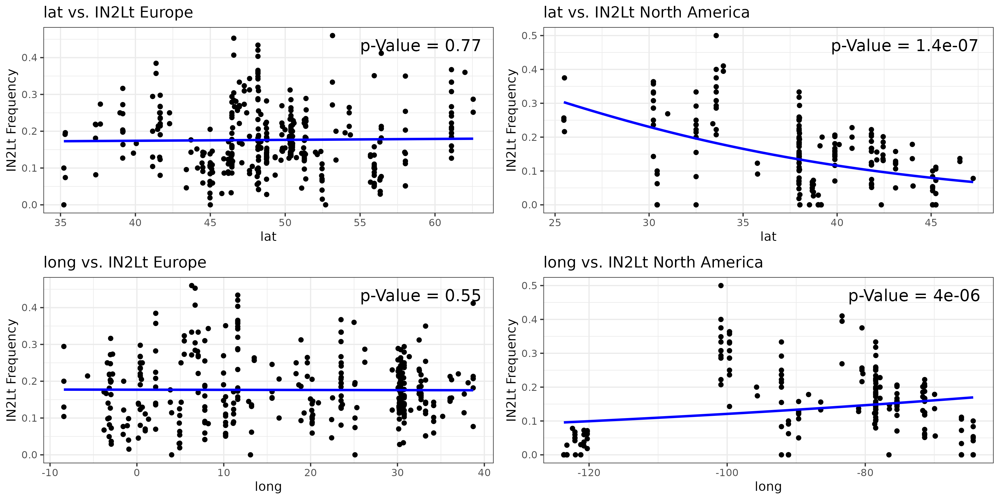
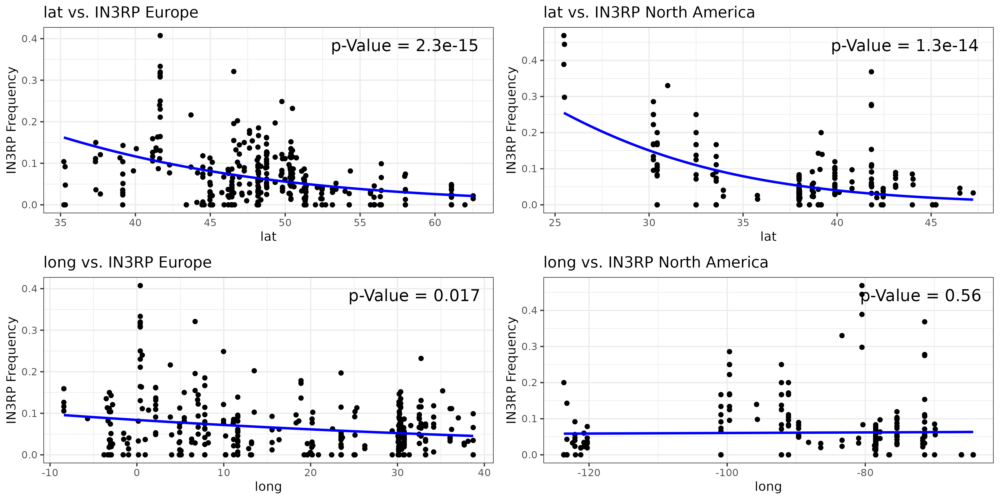
>> **Figure 8**: Scatterplots showing the association between inversion frequencies and both latitude (rows 1 and 3) and longitude (rows 2 and 4) in Europe (left) and North America (right) for In(2L)t (top) and In(3R)Payne (bottom). Logistic regression curves are shown in blue and the p-value of the regression models (adjusted R2 value) are printed in the top-right corner of each plot.

> In the final analyses of this book chapter, we will employ LFMMs to test, if the inversion clines deviate from neutral expectations. Therefore, we will again use allele frequency matrices of the two continental subsets and add the frequency information of the inversion to the matrix. In addition, we will obtain information on latitudinal and longitudinal coordinates for all samples from the metadata table. Importantly, since we want to assess the clinal patterns of an inversion relative to the genomic background, we will exclude all SNPs located within the genomic region of the inversion for the calculation of the background to avoid confounding our analysis by a high degree of linkage with SNPs in this genomic region. Then, we will perform a PCA based on all SNPs and only consider a subset of the PC-axes as latent factors for the calculation of the latent factor mixed models. Here, we will include all PC-axes that cumulatively explain at least 25% of the genetic variation to avoid overfitting the model with too many latent factors. After calculating SNP-wise LFMMs using latitude and longitude as predictor variables, we will visualize the -log10-transformed p-values in Manhattan plots and include the p-value of the inversion as a horizontal bar at the corresponding genomic position. We will furthermore add the Bonferroni-corrected p-value threshold as a blue horizontal line. This threshold will be calculated by dividing the significance threshold α = 0.05 by the total number of tests and will help us to account for a multiple testing problem which could lead to significant results by chance alone. Particularly, if the p-value of the inversion is higher than the -log10-transformed threshold, we can assume that the clinal patterns cannot be explained by chance and neutral evolution alone. The R commands to carry out all the above-mentioned analyses steps are stored in LFMM.r.

```bash
### Test with LFMMs if clinality due to demography or potentially adaptive
for index in ${!DATA[@]}; do

    INVERSION=${DATA[index]}
    St=${Start[index]}
    En=${End[index]}
    Ch=${Chrom[index]}

    Rscript ${WD}/scripts/LFMM.r \
        ${INVERSION} \
        ${Ch} \
        ${St} \
        ${En} \
        ${WD}

done
```
The Manhattan plots in Figure 9 show that neither In(2L)t nor In(3R)Payne are significantly associated with latitude nor longitude in Europe, and are also not correlated with longitude in North America. However, both inversions exhibit highly significant correlations with latitude in North America, which indicates that these clinal patterns cannot be explained by the demographic history of the investigated populations alone. This finding is consistent with previous studies and suggests that these two inversions presumably provide an advantage under certain environmental conditions at low latitudes but are not so beneficial in northern areas (56, 61, 79, 86). Particularly the North American East coast, where most of the samples in our dataset were collected, is characterized by steep and continuous environmental gradients (such as temperature, precipitation and seasonality) ranging from subtropical conditions in southern Florida to temperate climates in Maine. Since many of these environmental gradients are highly intercorrelated, it is difficult to disentangle which factor influences clinal variation in inversion frequencies the most (87). However, as a follow-up to the LFMM analysis based on latitude and longitude shown here, it would be worthwhile to focus on environmental variables, such temperature and precipitation, as predictors in similar downstream analyses to further explore which environmental conditions may influence the distribution of our two focal inversions the most.

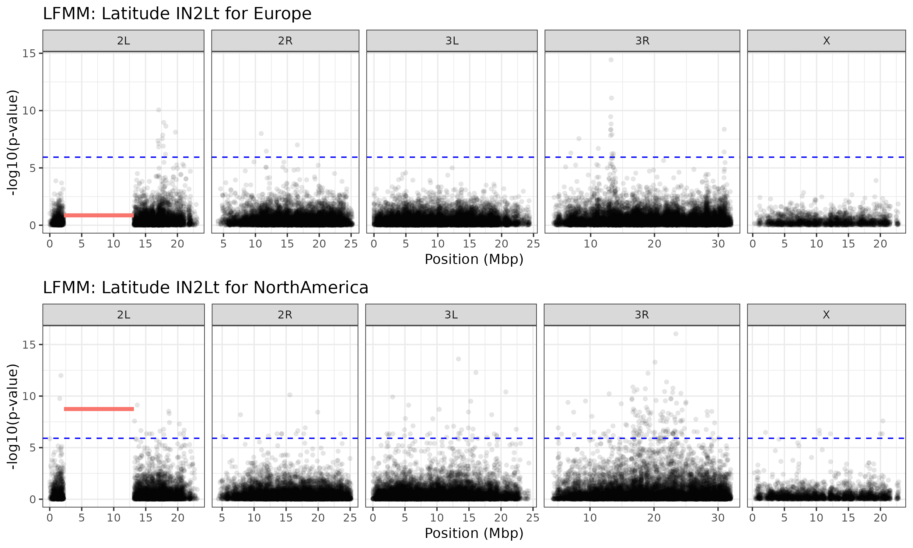
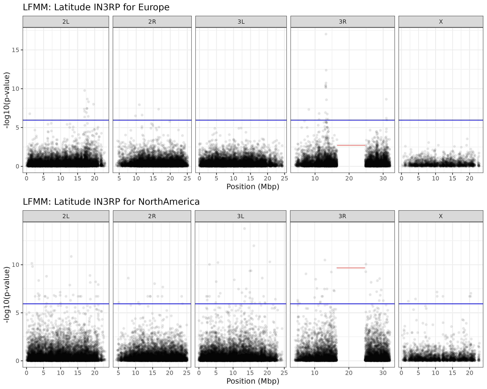
>> **Figure 9**: Manhattan plots showing the -log10-transformed p-values of LFMM analyses that tested for significant associations between allele frequencies and environmental variables, in our case latitude and longitude (not shown). We included the inversion frequencies of In(2L)t (top) and In(3R)Payne (bottom) from Europe (rows 1 and 3) and North America (rows 2 and 4) in this analysis and show their p-value as a solid red line spanning their genomic region. In addition, we include the Bonferroni-corrected p-value threshold as a blue dashed line. Results for longitude are not shown since inversion frequencies were not significantly associated in any of the tests. However, the corresponding Manhattan plots can be found in the output folder in the GitHub repository.

### Conclusions
In this book chapter, I briefly introduced a broad variety of bioinformatic methods to explore the evolutionary effects of chromosomal inversions. The analyses that we conducted above hopefully helped to better understand the impact of chromosomal inversions on genome evolution and genetic variation in natural populations. By necessity, the pipeline described here, is quite specific to data available for the well-studied model organism D. melanogaster. However, I hope that the concepts, ideas and workflows described in the previous pages prove helpful when designing similar analyses for other systems and research questions.

### Acknowledgments
I am very grateful to Lino Ometto, who invited me to write this book chapter and to Elisabeth Haring for providing helpful comments to the manuscript.

### References
1. 	Berdan EL, Barton NH, Butlin R, et al (2023) How chromosomal inversions reorient the evolutionary process. J Evol Biol jeb.14242
2. 	Krimbas KV and Powell JR, Eds, (1992) Drosophila inversion polymorphism, CRC Press, Boca Raton, Fla
3. 	Hoffmann AA and Rieseberg LH (2008) Revisiting the Impact of Inversions in Evolution: From Population Genetic Markers to Drivers of Adaptive Shifts and Speciation? Annu Rev Ecol Evol Syst 39:21–42
4. 	Torgasheva AA and Borodin PM (2010) Synapsis and recombination in inversion heterozygotes. Biochem Soc Trans 38:1676
5. 	Bridges CB (1935) Salivary Chromosome Maps. J Hered 26:60–64
6. 	Cooper KW (1938) Concerning the Origin of the Polytene Chromosomes of Diptera. Proc Natl Acad Sci U S A 24:452–458
7. 	Dobzhansky T and Sturtevant A (1938) Inversions in the Chromosomes of Drosophila Pseudoobscura. Genetics 23:28–64
8. 	Sturtevant AH (1921) A Case of Rearrangement of Genes in Drosophila. Proc Natl Acad Sci 7:235–237
9. 	Sturtevant AH (1926) A Crossover reducer in Drosophila Melanogaster due to inversion of a section of the third chromosome by A. H. Sturtevant by A. H. Sturtevant: Collectible; Good Pamphlet (1926) | Robinson Street Books, IOBA. Biol Zent Bl 46:697–702
10. 	Dobzhansky T and Epling C (1948) The Suppression of Crossing Over in Inversion Heterozygotes of Drosophila Pseudoobscura. Proc Natl Acad Sci 34:137–141
11. 	Anderson WW, Arnold J, Baldwin DG, et al (1991) Four decades of inversion polymorphism in Drosophila pseudoobscura. Proc Natl Acad Sci 88:10367–10371
12. 	Ranz JM, Maurin D, Chan YS, et al (2007) Principles of Genome Evolution in the Drosophila melanogaster Species Group. PLoS Biol 5:e152
13. 	Kellis M, Patterson N, Endrizzi M, et al (2003) Sequencing and comparison of yeast species to identify genes and regulatory elements. Nature 423:241–254
14. 	Cáceres M, Barbadilla A, and Ruiz A (1997) Inversion length and breakpoint distribution in the Drosophila buzzatti species complex. Evolution 51:1149–1155
15. 	Corbett-Detig RB (2016) Selection on Inversion Breakpoints Favors Proximity to Pairing Sensitive Sites in Drosophila melanogaster. Genetics 204:259–265
16. 	Puerma E, Orengo DJ, and Aguadé M (2016) Multiple and diverse structural changes affect the breakpoint regions of polymorphic inversions across the Drosophila genus. Sci Rep 6
17. 	Ashburner M and Lemeunier F (1976) Relationships within the melanogaster Species Subgroup of the Genus Drosophila (Sophophora). I. Inversion Polymorphisms in Drosophila melanogaster and Drosophila simulans. Proc R Soc Lond B Biol Sci 193:137–157
18. 	Capy P and Gibert P (2004) Drosophila melanogaster, Drosophila simulans: so similar yet so different, In: Capy, P., Gibert, P., and Boussy, I. (eds.) Drosophila melanogaster, Drosophila simulans: So Similar, So Different, pp. 5–16 Springer Netherlands, Dordrecht
19. 	Lemeunier F and Aulard S (1992) Inversion polymorphism in Drosophila melanogaster, Presented at the 
20. 	Titen SWA, Johnson MTB, Capecchi M, et al (2020) Site-Specific Recombination with Inverted Target Sites: A Cautionary Tale of Dicentric and Acentric Chromosomes. Genetics 215:923–930
21. 	Charlesworth B (2023) The effects of inversion polymorphisms on patterns of neutral genetic diversity. Genetics 224:iyad116
22. 	Guerrero RF, Rousset F, and Kirkpatrick M (2012) Coalescent patterns for chromosomal inversions in divergent populations. Philos Trans R Soc B Biol Sci 367:430–438
23. 	Navarro A, Betrán E, Barbadilla A, et al (1997) Recombination and gene flux caused by gene conversion and crossing over in inversion heterokaryotypes. Genetics 146:695–709
24. 	Gorlov IP and Borodin PM (1995) Recombination in single and double heterozygotes for two partially overlapping inversions in chromosome 1 of the house mouse. Heredity 75:113–125
25. 	Andolfatto P, Depaulis F, and Navarro A (2001) Inversion polymorphisms and nucleotide variability in Drosophila. Genet Res 77
26. 	Chovnick A (1973) Gene conversion and transfer of genetic information within the inverted region of inversion heterozygotes. Genetics 75:123–131
27. 	Navarro A, Barbadilla A, and Ruiz A (2000) Effect of Inversion Polymorphism on the Neutral Nucleotide Variability of Linked Chromosomal Regions in Drosophila. Genetics 155:685–698
28. 	Kennington JW, Partridge L, and Hoffmann AA (2006) Patterns of Diversity and Linkage Disequilibrium Within the Cosmopolitan Inversion In(3R)Payne in Drosophila melanogaster Are Indicative of Coadaptation. Genetics 172:1655–1663
29. 	Kirkpatrick M and Kern A (2012) Where’s the Money? Inversions, Genes, and the Hunt for Genomic Targets of Selection. 190:1153–1155
30. 	Faria R, Johannesson K, Butlin RK, et al (2019) Evolving Inversions. Trends Ecol Evol 34:239–248
31. 	Kapun M, Mitchell ED, Kawecki TJ, et al (2023) An Ancestral Balanced Inversion Polymorphism Confers Global Adaptation. Mol Biol Evol 40:msad118
32. 	Wright D and Schaeffer SW (2022) The relevance of chromatin architecture to genome rearrangements in Drosophila. Philos Trans R Soc Lond B Biol Sci 377:20210206
33. 	Matzkin LM, Merritt TJS, Zhu C-T, et al (2005) The structure and population genetics of the breakpoints associated with the cosmopolitan chromosomal inversion In(3R)Payne in Drosophila melanogaster. Genetics 170:1143–1152
34. 	Griffiths AJF, Doebley JF, Peichel CL, et al (2020) Introduction to genetic analysis, W.H. Freeman & Company/Macmillan Learning, New York, NY
35. 	Kapun M and Flatt T (2019) The adaptive significance of chromosomal inversion polymorphisms in Drosophila melanogaster. Mol Ecol 28:1263–1282
36. 	Kirkpatrick M (2010) How and Why Chromosome Inversions Evolve. PLoS Biol 8:e1000501
37. 	Kirkpatrick M and Barton N (2006) Chromosome inversions, local adaptation and speciation. Genetics 173:419–434
38. 	Schwander T, Libbrecht R, and Keller L (2014) Supergenes and complex phenotypes. Curr Biol 24:R288-94
39. 	Villoutreix R, Ayala D, Joron M, et al (2021) Inversion breakpoints and the evolution of supergenes. Mol Ecol 30:2738–2755
40. 	Küpper C, Stocks M, Risse JE, et al (2016) A supergene determines highly divergent male reproductive morphs in the ruff. Nat Genet 48:79–83
41. 	Lamichhaney S, Fan G, Widemo F, et al (2016) Structural genomic changes underlie alternative reproductive strategies in the ruff (Philomachus pugnax). Nat Genet 48:84–88
42. 	Lank DB, Smith CM, Hanotte O, et al (1995) Genetic polymorphism for alternative mating behaviour in lekking male ruff Philomachus pugnax. Nature 378:59–62
43. 	Joron M, Papa R, Beltrán M, et al (2006) A Conserved Supergene Locus Controls Colour Pattern Diversity in Heliconius Butterflies. PLoS Biol 4:e303
44. 	Joron M, Frezal L, Jones RT, et al (2011) Chromosomal rearrangements maintain a polymorphic supergene controlling butterfly mimicry. Nature 477:203–206
45. 	Lee Y, Fishman L, Kelly JK, et al (2016) A Segregating Inversion Generates Fitness Variation in Yellow Monkeyflower (Mimulus guttatus). Genetics 202:1473–1484
46. 	Lowry DB and Willis JH (2010) A Widespread Chromosomal Inversion Polymorphism Contributes to a Major Life-History Transition, Local Adaptation, and Reproductive Isolation. PLoS Biol 8:e1000500
47. 	Koch EL, Morales HE, Larsson J, et al (2021) Genetic variation for adaptive traits is associated with polymorphic inversions in Littorina saxatilis. Evol Lett 5:196–213
48. 	Durmaz E, Kerdaffrec E, Katsianis G, et al (2020) How Selection Acts on Chromosomal Inversions, In: eLS, pp. 307–315 American Cancer Society
49. 	Mackintosh C, Scott MF, Reuter M, et al (2024) Locally adaptive inversions in structured populations. Genetics iyae073
50. 	Schaal SM, Haller BC, and Lotterhos KE (2022) Inversion invasions: when the genetic basis of local adaptation is concentrated within inversions in the face of gene flow. Philos Trans R Soc B Biol Sci 377:20210200
51. 	Charlesworth B (1974) Inversion polymorphism in a two-locus genetic system. Genet Res 23:259
52. 	Charlesworth B and Flatt T (2021) On the fixation or nonfixation of inversions under epistatic selection. Mol Ecol 30:3896–3897
53. 	Dobzhansky T (1948) Genetics of natural populations. XVIII. Experiments on chromosomes of Drosophila pseudoobscura from different geographic regions. Genetics
54. 	Fuller ZL, Koury SA, Leonard CJ, et al (2020) Extensive Recombination Suppression and Epistatic Selection Causes Chromosome-Wide Differentiation of a Selfish Sex Chromosome in Drosophila pseudoobscura. Genetics 216:205–226
55. 	Guzmán NV, Kemppainen P, Monti D, et al (2022) Stable inversion clines in a grasshopper species group despite complex geographical history. Mol Ecol 31:1196–1215
56. 	Kapun M, Fabian DK, Goudet J, et al (2016) Genomic Evidence for Adaptive Inversion Clines in Drosophila melanogaster. Mol Biol Evol 33:1317–1336
57. 	Mérot C, Berdan EL, Cayuela H, et al (2021) Locally Adaptive Inversions Modulate Genetic Variation at Different Geographic Scales in a Seaweed Fly. Mol Biol Evol 38:3953–3971
58. 	Kapun M, Schmidt C, Durmaz E, et al (2016) Parallel effects of the inversion In(3R)Payne on body size across the North American and Australian clines in Drosophila melanogaster. J Evol Biol 29:1059–1072
59. 	Durmaz E, Benson C, Kapun M, et al (2018) An inversion supergene in Drosophila underpins latitudinal clines in survival traits. J Evol Biol 31:1354–1364
60. 	Corbett-Detig RB and Hartl DL (2012) Population Genomics of Inversion Polymorphisms in Drosophila melanogaster. PLoS Genet 8:e1003056
61. 	Kapun M, Schalkwyk H van, McAllister B, et al (2014) Inference of chromosomal inversion dynamics from Pool-Seq data in natural and laboratory populations of Drosophila melanogaster. Mol Ecol 23:1813–1827
62. 	Schlötterer C, Tobler R, Kofler R, et al (2014) Sequencing pools of individuals — mining genome-wide polymorphism data without big funding. Nat Rev Genet 15:749–763
63. 	Kapun M, Nunez JCB, Bogaerts-Márquez M, et al (2021) Drosophila Evolution over Space and Time (DEST): A New Population Genomics Resource. Mol Biol Evol 38:5782–5805
64. 	UNPUBLISHED (2024) Characterizing footprints worldwide adaptation in structured populations of D. melanogaster through the expanded DEST 2.0 genomic resource.
65. 	Lack JB, Cardeno CM, Crepeau MW, et al (2015) The Drosophila Genome Nexus: A Population Genomic Resource of 623 Drosophila melanogaster Genomes, Including 197 from a Single Ancestral Range Population. Genetics 199:1229–1241
66. 	Lack JB, Lange JD, Tang AD, et al (2016) A Thousand Fly Genomes: An Expanded Drosophila Genome Nexus. Mol Biol Evol 33:msw195-3313
67. 	Hoskins RA, Carlson JW, Wan KH, et al (2015) The Release 6 reference sequence of the Drosophila melanogaster genome. Genome Res 25:445–458
68. 	Kapun M, Barrón MG, Staubach F, et al (2020) Genomic Analysis of European Drosophila melanogaster Populations Reveals Longitudinal Structure, Continent-Wide Selection, and Previously Unknown DNA Viruses. Mol Biol Evol 37:2661–2678
69. 	Tange O (2018) GNU Parallel 2018, Ole Tange
70. 	Nei M and Li WH (1979) Mathematical model for studying genetic variation in terms of restriction endonucleases. Proc Natl Acad Sci U S A 76:5269–5273
71. 	Danecek P, Auton A, Abecasis G, et al (2011) The variant call format and VCFtools. Bioinformatics 27:2156–2158
72. 	Wickham H, Averick M, Bryan J, et al (2019) Welcome to the Tidyverse. J Open Source Softw 4:1686
73. 	R Core Team (2019), R Foundation for Statistical   Computing, https://www.R-project.org/
74. 	Haudry A, Laurent S, and Kapun M (2020) Population genomics on the fly: recent advances in Drosophila. Stat Popul Genomics 357–396
75. 	Weir BS and Cockerham CC (1984) Estimating F-Statistics for the Analysis of Population Structure. Evolution 38:1358
76. 	Futschik A and Schlötterer C (2010) The Next Generation of Molecular Markers From Massively Parallel Sequencing of Pooled DNA Samples. Genetics 186:207–218
77. 	Novembre J and Stephens M (2008) Interpreting principal component analyses of spatial population genetic variation. Nat Genet 40:646–649
78. 	Nunez JCB, Lenhart BA, Bangerter A, et al (2024) A cosmopolitan inversion facilitates seasonal adaptation in overwintering Drosophila. Genetics 226:iyad207
79. 	Anderson AR, Hoffmann AA, Mckechnie SW, et al (2005) The latitudinal cline in the In(3R)Payne inversion polymorphism has shifted in the last 20 years in Australian Drosophila melanogaster populations. Mol Ecol 14:851–858
80. 	Nielsen R (2005) Molecular signatures of natural selection. Annu Rev Genet 39:197–218
81. 	Storz JF (2005) Using genome scans of DNA polymorphism to infer adaptive population divergence. Mol Ecol 14:671–688
82. 	Lewontin RC and Krakauer J (1973) Distribution of Gene Frequency as a Test of the Theory of the Selective Neutrality of Polymorphisms. Genetics 74:175–195
83. 	Dauphin B, Rellstab C, Wüest RO, et al (2023) Re-thinking the environment in landscape genomics. Trends Ecol Evol 38:261–274
84. 	Caye K, Jumentier B, Lepeule J, et al (2019) LFMM 2: Fast and Accurate Inference of Gene-Environment Associations in Genome-Wide Studies. Mol Biol Evol 36:852–860
85. 	Frichot E, Schoville SD, Bouchard G, et al (2013) Testing for Associations between Loci and Environmental Gradients Using Latent Factor Mixed Models. Mol Biol Evol 30:1687–1699
86. 	Kennington JW and Hoffmann AA (2013) Patterns of genetic variation across inversions: geographic variation in the In(2L)t inversion in populations of Drosophila melanogaster from eastern Australia. BMC Evol Biol 13:100
87. 	Bogaerts-Márquez M, Guirao-Rico S, Gautier M, et al (2021) Temperature, rainfall and wind variables underlie environmental adaptation in natural populations of Drosophila melanogaster. Mol Ecol 30:938–954

